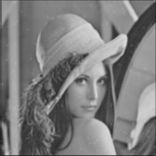

## **EE6470_ESL_HW3**
### <span style="font-family: '標楷體'; font-weight: lighter;">112062707 廖哲緯</span> 
---
High level synthesis of Gaussian Blur Filter<br>
- In this homework, Please design a HLS synthesizable version of the Gaussian Blur Filter module.<br>
+ Please follow the system.h, tb.h, tb.cc, dut.h, dut.cc file structure from Stratus labs.
## **Part 1**
### Requirment
Base Implementation
* Please write a synthesizable design of SystemC dut modules.
* Make sure to implement a buffer-based "flow" dut, which would cache and reuse inputs.
### Compile and Execute
```powershell
login EE workstation
$ ssh daisy.ee.nthu.edu.tw
$ ssh ws26
$ source /usr/cadtool/user_setup 01-cadence_license_set.cshset
$ source /usr/cad/cadence/cic_setup/stratus.cshrc
$ source /usr/cadtool/user_setup/03-xcelium.csh
$ cd part1/sobel_stratus/stratus
$ make sim_B
$ make sim_V_BASIC
```
### Implementation
Testbench.h<br>
Include fixed point for stratus because stratus HLS not support C++ flaot/double
```h
#include <cynw_fixed.h>
```
Testbench.cpp<br>
Using the fixed point.
```cpp
	sc_fixed_fast<23,17> total;
```
SobelFilter.h<br>
Include fixed point for stratus 
```h
#include <cynw_fixed.h>
```
SobelFilter.cpp<br>
Using the fixed point.
```cpp
    sc_fixed_fast<14,10> grey = 0;
    sc_fixed_fast<23,17> total = 0;
```

### Result
Use image "lena_color_256_noise" as input
- **Input image** 


- **Output image** 


- **area** <br>
The synthesis report in
~/part1/sobel_stratus/stratus/bdw_work/modules/SobelFilter/BASIC/stratus_hls.log<br>
The estimated area is 16488.7
- **latency and throughput** 
The Verilog simulated report in
~/part1/sobel_stratus/stratus/bdw_work/sims/V_BASIC/bdw_sim.log<br>
Average Latency = 60 ns<br>
Throughput = 0.000657895 (process/ns)

## **Part 2**
### Requirment
Improve coding styles
* Please use bit width to constrain the operators.
* Please simplify and reduce math expressions as much as possible, e.g., removing or simplifying multiplication and division, etc.
* Please compare the improved version with base implementation (area, latency and throughput).
### Compile and Execute
```powershell
$ cd part2/sobel_stratus/stratus
$ make sim_B
$ make sim_V_BASIC
```
### Implementation
SobelFilter.cpp<br>
Simplify and reduce math expressions
```cpp
	buffer[u+(v<<2)+v]=buffer[u+(v<<2)+v+1];
	if (x == 0 && y == 0) buffer[u+(v<<2)+v] = grey;
	else if (u != MASK_X - 1 && x != 0) grey = buffer[u+(v<<2)+v];
	else if (u == MASK_X - 1) buffer[u+(v<<2)+v] = grey;
```
### Result
Use image "lena_color_256_noise.bmp" as input
- **Input image** 


- **Output image** 


- **area**<br>
The synthesis report in
~/part2/sobel_stratus/stratus/bdw_work/modules/SobelFilter/BASIC/stratus_hls.log<br><br>
The estimated area is 11187.2
compare with part1(original) save area: 16488.7 - 11187.2 = 5301.5
- **latency and throughput**<br>
The Verilog simulated report in
~/part2/sobel_stratus/stratus/bdw_work/sims/V_BASIC/bdw_sim.log<br><br>
Average Latency = 50 ns<br>
compare with part1(original) reduce: 60 - 50 = 10 ns<br><br>
Throughput = 0.000787402 (process/ns)
compare with part1(original) increase: 0.000787402 - 0.000657895 = 0.000129507 (process/ns) = 129507 (process/s)

## **Part 3**
### Requirment
Optimized Implementation
* Please use Stratus directive of loop pipelining, unrolling, etc. to improve the throughput and latency of your design.
* Please compare the optimized version with previous implementation (area, latency and throughput).
### Compile and Execute
```powershell
$ cd part3/sobel_stratus/stratus
$ make sim_B
$ make sim_V_BASIC
```
### Implementation
project.tcl<br>
Stratus directive of loop unrolling
```.tcl
define_hls_config SobelFilter BASIC -post_elab_tcl {
    unroll_loops [find -loop "*_loop" ]
    constrain_latency [find -loop "while_1"]
}
```
### Result
Use image "lena_color_256_noise.bmp" as input
- **Input image** 


- **Output image** 


- **area**<br>
The synthesis report in
~/part3/sobel_stratus/stratus/bdw_work/modules/SobelFilter/BASIC/stratus_hls.log<br><br>
The estimated area is 13085.3
compare with part1(original) save area: 16488.7 - 13085.3 = 3403.4
- **latency and throughput**<br>
The Verilog simulated report in
~/part3/sobel_stratus/stratus/bdw_work/sims/V_BASIC/bdw_sim.log<br><br>
Average Latency = 30 ns<br>
compare with part1(original) reduce: 60 - 30 = 30 ns<br><br>
Throughput = 0.00103093 (process/ns)
compare with part1(original) increase: 0.00103093 - 0.000657895 = 0.000373035 (process/ns) = 373035 (process/s)